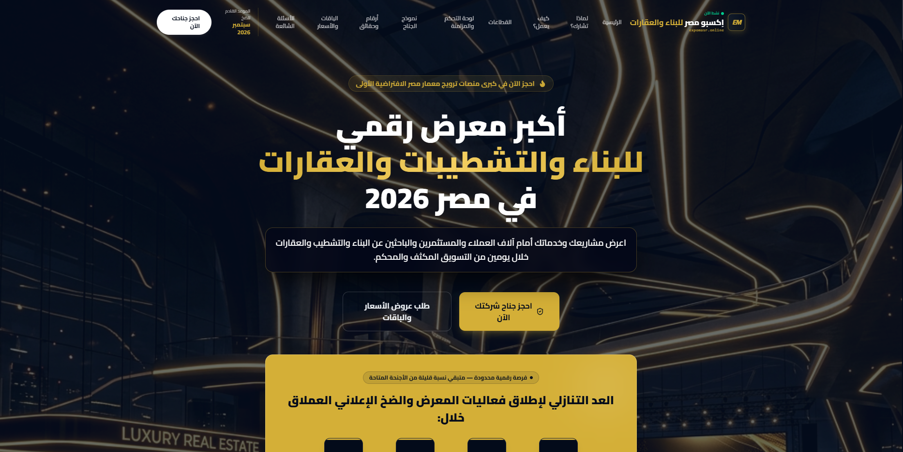

<div align="center">

</div>

# 🏢 معرض معمار مصر الرقمي 2026 - Expo MASR

منصة رقمية تفاعلية لعرض الأجنحة الافتراضية والحجوزات الإلكترونية لمعرض معمار مصر 2026.

## 🌟 الميزات الرئيسية

- 🎪 أجنحة رقمية تفاعلية للشركات والمؤسسات
- 💼 نظام إدارة الحجوزات للأدمن
- 📊 لوحة تحكم شاملة لعرض البيانات
- 🔐 نظام تسجيل دخول آمن
- 📱 تصميم متجاوب يعمل على جميع الأجهزة
- 🌍 دعم الواجهة العربية

## 📋 المتطلبات

- Node.js (v18 أو أحدث)
- Python 3.8+ (للـ Backend)
- npm أو yarn

## 🚀 التثبيت والتشغيل

### Frontend (React + TypeScript + Vite)

```bash
# تثبيت المتعلقات
npm install

# تشغيل خادم التطوير
npm run dev

# بناء النسخة الإنتاجية
npm run build
```

### Backend (Flask)

```bash
# الانتقال إلى مجلد Backend
cd backend

# تثبيت المكتبات المطلوبة
pip install -r requirements.txt

# تشغيل الخادم
python app.py
```

الخادم سيعمل على: `http://localhost:5000`

## 🔑 متغيرات البيئة

أنشئ ملف `.env.local` في الجذر:

```env
# Admin Credentials
ADMIN_USERNAME=admin
ADMIN_PASSWORD=your_secure_password

# Backend URL
VITE_API_URL=http://localhost:5000
```

## 📁 هيكل المشروع

```
expomasr/
├── src/                    # الواجهة الأمامية (React)
│   ├── components/         # مكونات React
│   ├── assets/            # الصور والموارد
│   ├── utils/             # دوال مساعدة
│   └── main.tsx           # نقطة الدخول الرئيسية
├── backend/               # خادم Python
│   ├── app.py            # تطبيق Flask الرئيسي
│   ├── bookings.db       # قاعدة البيانات
│   └── templates/        # صفحات HTML
├── public/               # الملفات الثابتة
└── package.json          # المتعلقات الأمامية
```

## 🛠️ المتكاملات

- **Flask** - خادم ويب Python
- **React** - مكتبة بناء الواجهات
- **TypeScript** - لغة برمجة مكتوبة بقوة
- **Vite** - أداة بناء سريعة
- **SQLite** - قاعدة بيانات خفيفة الوزن

## 👤 حساب الأدمن

الوصول إلى لوحة التحكم:
- الرابط: `http://localhost:5000/admin/login`
- اسم المستخدم: `admin`
- كلمة المرور: تغيير عبر متغيرات البيئة

## 📊 APIs المتاحة

| الطلب | الرابط | الوصف |
|------|--------|-------|
| POST | `/api/bookings` | إنشاء حجز جديد |
| GET | `/api/bookings` | استرجاع جميع الحجوزات |
| GET | `/api/bookings/stats` | إحصائيات الحجوزات |
| GET | `/admin/` | لوحة تحكم الأدمن |
| GET | `/admin/export` | تصدير البيانات CSV |

## 📝 الترخيص

هذا المشروع مرخص تحت رخصة MIT. انظر ملف [LICENSE](LICENSE) للتفاصيل.

## 👨‍💻 المساهمة

نرحب بالمساهمات! يرجى إنشاء fork والمساهمة عبر pull requests.

## 📞 التواصل

للأسئلة والدعم الفني، يرجى فتح issue في المستودع.
